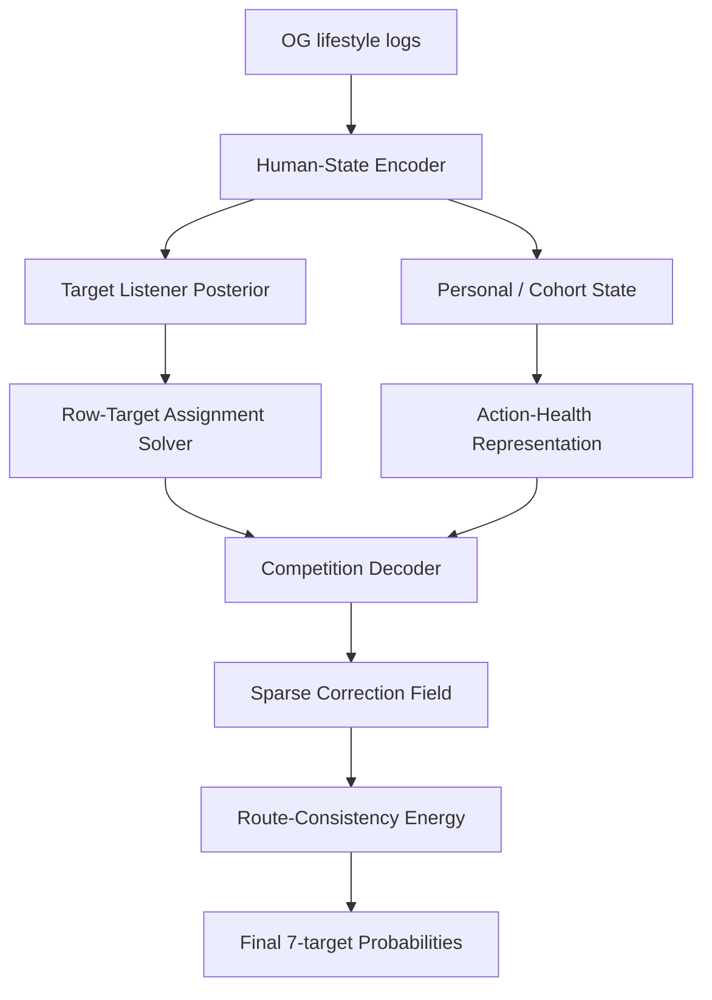

# HS-JEPA Architecture Package

## 목적

이 문서는 HS-JEPA를 단순한 제출 파일 조합이 아니라, 수면 기반 생활 로그에서 숨은 인간 상태와 row-target action을 분리해 복원하는 아키텍처로 설명하기 위한 팀 공유용 패키지다.

핵심 목표는 두 가지다.

1. 대회 성능 관점: public LB `0.5677475939` frontier 이후 어떤 hidden-state action 후보가 의미 있는지 정리한다.
2. 논문 관점: leaderboard sensor와 OG 데이터 기반 representation을 구분해, HS-JEPA가 무엇을 새롭게 제안하는지 명확히 한다.

## 한 문장 정의

HS-JEPA는 생활 로그를 바로 label로 매핑하지 않고, 인간 생활 상태, target listener, row-target assignment, action health, route energy를 분리해 예측하고 결합하는 joint embedding predictive architecture다.

## 왜 일반 tabular 모델과 다른가

일반적인 대회 접근은 다음 형태다.

```text
raw feature -> model -> Q1/Q2/Q3/S1/S2/S3/S4 probability
```

HS-JEPA는 문제를 다르게 본다.

```text
raw lifestyle logs
  -> hidden human-state representation
  -> target-listener representation
  -> row-target assignment
  -> action-health / toxicity field
  -> route-consistent correction
  -> final probability
```

즉 label을 직접 예측하지 않고, label이 생기는 중간 구조를 예측한다.

## LeCun JEPA에서 가져온 것

여기서 JEPA를 그대로 복제하지 않는다.

가져온 핵심은 다음 질문이다.

```text
보이는 context로 보이지 않는 representation을 예측할 수 있는가?
```

HS-JEPA에서는 다음처럼 번역된다.

| JEPA 요소 | HS-JEPA의 대응 |
| --- | --- |
| context | 생활 로그, row order, subject/cohort state, target identity, submission disagreement |
| target representation | label 자체가 아니라 human-state, target listener, support, action field |
| mask | feature mask가 아니라 row/target/source/public-private mask |
| predictor | context에서 hidden state/action representation을 예측 |
| energy | collapse, shortcut, toxic action, route violation 감지 |

## 전체 구조



## 모듈별 역할

### 1. Human-State Encoder

역할:

- 개인의 평소 상태와 오늘 상태의 차이를 표현한다.
- 비슷한 peer cohort 안에서 오늘이 얼마나 튀는지 표현한다.
- social/routine/sleep-state 가설을 직접 label rule로 쓰지 않고 latent context로 만든다.

근거:

- cohort-relative atlas와 human-state distillation 실험.

한계:

- row assignment를 단독으로 맞히지는 못한다.

### 2. Target Listener Posterior

역할:

- 어느 target/cell route가 hidden state와 잘 맞는지 예측한다.
- 특히 objective S-stage, S2-hub route에서 강하다.

근거:

- S2-hub cell-level OOF AUC `0.775`
- Stagebridge cell-level OOF AUC `0.722`

한계:

- cell posterior를 row로 aggregate해도 row AUC는 `0.556` 정도라 row assignment 본체가 되기 어렵다.

### 3. Row-Target Assignment Solver

역할:

- 250 rows x 7 targets = 1750개 cell 중 실제로 움직일 sparse support를 고른다.
- 현재 대회 성능에서는 public-loss sparse tomography와 stagebridge solver가 가장 강하다.

근거:

- H012 이후 public LB가 `0.5681234831`로 큰 폭 개선.
- H057 public LB `0.5677475939`.
- stagebridge/s2hub 계열이 route-consistent action 후보를 생성.

주의:

- 이 모듈을 논문 본체로 과장하면 leaderboard sensor 후처리라는 비판을 받을 수 있다.
- 논문에서는 competition-specific teacher/decoder로 분리해 설명해야 한다.

### 4. Action-Health / Toxicity Decoder

역할:

- 선택된 cell을 어느 방향과 강도로 움직일지 판단한다.
- public-bad anchor와 H088 negative sensor를 action toxicity diagnostic으로 쓴다.

근거:

- H088 dual-head Pareto gate는 public LB `0.5684942019`로 악화되어, action decoder가 아니라 toxicity/stress diagnostic임을 보여줌.

### 5. Route-Consistency Energy

역할:

- correction 이후 7-target vector가 train-label Q/S 공동 구조를 깨는지 검사한다.
- LeJEPA식 representation/action health diagnostic에 해당한다.

근거:

- route energy veto가 aggressive candidate의 toxic cells를 대량 제거.
- stagebridge_jackpot route energy `0.725652`.
- s2hub_jackpot route energy `0.724714`.
- target-listener lift jackpot route energy `0.724585`.

## 지금까지의 핵심 발견

### 발견 1. Public equation은 진짜 큰 구조였다

`submission_h012_public_equation_top_all_k1200_a0.7_uploadsafe.csv`가 public LB `0.5681234831`을 기록하면서, 단순 모델 성능 문제가 아니라 public-sensitive row-target action field가 존재한다는 점이 드러났다.

### 발견 2. H057은 row-target hidden state를 더 잘 맞혔다

`submission_h057_q2row_fullvector_state_7cde1a77_uploadsafe.csv`는 public LB `0.5677475939`까지 내려갔다.

이것은 HS-JEPA가 다루려는 대상이 row 전체 예측이 아니라 row-target correction field라는 근거다.

### 발견 3. Objective S-stage에는 bridge 구조가 있다

`stagebridge_jackpot`은 driver action에 route-preserving bridge action을 붙이는 방식으로 `97` changed cells, `54` rows를 만든다.

이는 전체 S-stage factor를 한 방향으로 움직이는 것보다 더 강하다.

### 발견 4. S2는 public-sensitive listener/hub다

`s2hub_jackpot`은 모든 selected bundle에 S2를 포함하면서 route energy `0.724714`를 얻었다.

S2는 전체 objective factor가 아니라, public-sensitive S-stage listener 또는 utility hub로 보는 것이 맞다.

Stress audit에서도 같은 결론이 나온다.

| 후보 | Selected route delta | Random route delta | S2 사용률 | Random S2 사용률 | Route p-value | S2 p-value |
| --- | ---: | ---: | ---: | ---: | ---: | ---: |
| Objective Bridge Primary | `-0.02457` | `-0.01090` | `0.780` | `0.615` | `0.0000` | `0.0006` |
| S2 Listener Bridge | `-0.02696` | `-0.01082` | `1.000` | `0.615` | `0.0000` | `0.0000` |

즉 selected bridge action은 가능한 후보 공간 안에서도 route energy를 비정상적으로 잘 낮추고, S2를 hub로 쓰는 경향도 random feasible action보다 훨씬 강하다.

### 발견 5. OG human-state는 row보다 target/cell orientation을 잘 설명한다

S2-hub human-state distillation:

| 항목 | 값 |
| --- | ---: |
| cell OOF AUC | `0.775` |
| row OOF AUC | `0.545` |

Target-listener route lift:

| 항목 | 값 |
| --- | ---: |
| S2-hub row-lift max AUC | `0.556` |
| S2-hub listener-lift extra cells | `13` |
| extra S2 cells | `10` |
| listener-lift public LB | `0.5680255019` |
| delta vs best `0.5677475939` | `+0.0002779080` |

따라서 HS-JEPA는 human-state encoder 하나로 모든 것을 해결하는 모델이 아니다.

정확한 구조는 다음이다.

```text
Human-state explains orientation.
Assignment solver finds support.
Energy decoder makes action safe.
```

Public 결과까지 반영하면, target-listener route lift는 성능 breakthrough가 아니라 모듈 경계 증거다.

```text
Target listener posterior is real,
but target listener posterior alone is not an action generator.
```

## 현재 제출 후보 해석

| 우선순위 | 파일 | 의미 |
| ---: | --- | --- |
| 1 | `submission_hsjepa_stage_bridge_conservation_stagebridge_jackpot_89d16116_uploadsafe.csv` | 가장 강한 objective-stage driver/bridge big bet |
| 2 | `submission_hsjepa_s2hub_bridge_s2hub_jackpot_f0866f50_uploadsafe.csv` | 가장 해석 가능한 S2 listener/hub big bet |
| 3 | `submission_hsjepa_ogdistilled_s2hub_jackpot_38d995b0_uploadsafe.csv` | OG human-state action-health gate probe |
| diagnostic only | `submission_hsjepa_target_listener_route_lift_s2hub_listener_lift_jackpot_f2ab2816_uploadsafe.csv` | public LB `0.5680255019`; extra S2 action은 public-safe하지 않았음 |

## 재현 명령

팀 공유용 end-to-end 재현:

```bash
python3 team_hsjepa_end_to_end/run_full_team_hsjepa_package.py
```

전체 dependency까지 새로 실행:

```bash
python3 team_hsjepa_end_to_end/run_full_team_hsjepa_package.py --refresh
```

위 명령은 package 생성, stress audit, claim/evidence validation, reproducibility contract, architecture readiness gate, paper method packet, 팀 핸드오프 리포트 생성을 한 번에 수행한다.

입력 출처를 OG raw data, public-LB sensor, competition anchor, generated output으로 분리한 계약 문서:

```text
team_hsjepa_end_to_end/outputs/route_conserving_s2_bridge/hsjepa_reproducibility_contract.md
```

논문/팀 공유용 아키텍처 주장으로 말해도 되는지 자동 판정하는 readiness report:

```text
team_hsjepa_end_to_end/outputs/route_conserving_s2_bridge/hsjepa_architecture_readiness_report.md
```

현재 판정:

```text
paper_ready_with_boundary
7/7 gates passed
```

논문 초안/발표 설명으로 바로 옮길 수 있는 method packet:

```text
team_hsjepa_end_to_end/outputs/route_conserving_s2_bridge/hsjepa_paper_method_packet_ko.md
```

개별 package 생성만 실행하려면:

```bash
python3 team_hsjepa_end_to_end/run_route_conserving_s2_bridge.py
```

Route-Conserving S2 Bridge가 단순 셀 선택이 아니라 후보 공간 대비 특이한 decoder rule인지 검증:

```bash
python3 team_hsjepa_end_to_end/audit_route_conserving_s2_bridge.py
```

팀 공유 패키지의 문서, submission, stress audit, claim boundary를 한 번에 검증:

```bash
python3 team_hsjepa_end_to_end/validate_route_conserving_s2_bridge_package.py
```

내부 모듈을 개별 재현하려면:

```bash
python3 final_hsjepa_candidates/candidate_1_public_loss_sparse_tomography.py
python3 paper_hsjepa_core/stage_bridge_conservation_solver.py
python3 paper_hsjepa_core/s2hub_bridge_solver.py
python3 paper_hsjepa_core/s2hub_human_state_distillation.py
python3 paper_hsjepa_core/target_listener_route_lift_solver.py
```

각 스크립트는 root에 upload-safe submission CSV를 만들고, `paper_hsjepa_core/outputs/...` 아래에 readout과 audit 파일을 남긴다.

새 팀 패키지는 `team_hsjepa_end_to_end/outputs/route_conserving_s2_bridge/` 아래에 evidence table과 package JSON을 만든다.

## 논문에서 주장할 수 있는 것

강하게 주장 가능:

- 수면 생활 로그 예측에서는 label 직접 예측보다 row-target correction field를 분리하는 것이 중요하다.
- human-state representation은 action orientation을 설명하지만 row support를 단독으로 해결하지 않는다.
- objective S-stage에는 local driver/bridge conservation 구조가 있다.
- S2는 public-sensitive target listener/hub로 반복 관측된다.
- route-consistency energy는 action toxicity를 줄이는 LeJEPA-style diagnostic으로 쓸 수 있다.

조심해야 할 주장:

- HS-JEPA가 OG feature만으로 public best를 재현한다.
- human-state latent 하나가 모든 row-target assignment를 해결한다.
- public-loss sparse tomography가 논문 본체다.

현재 가장 정직한 논문형 주장:

> We propose HS-JEPA, a modular joint embedding predictive architecture that separates human-state representation, target-listener responsibility, row-target assignment, and route-consistent action decoding. In sleep lifestyle prediction, the representation explains action orientation, while assignment and safety require separate listener and energy modules.

한국어:

> 우리는 HS-JEPA를 제안한다. HS-JEPA는 생활 로그에서 인간 상태, target listener, row-target assignment, route-consistent action decoder를 분리해 학습/해석하는 구조다. 이 대회에서 human-state representation은 action 방향을 설명하지만, 실제 sparse support와 public/private 안전성은 별도 listener/energy 모듈이 필요했다.

## 다음 큰 실험 후보

현재 가장 큰 미해결 문제는 여전히 row assignment다.

다음 big bet는 다음 둘 중 하나여야 한다.

1. Public-free row assignment teacher
   - public score ledger 없이 source/listener disagreement, S2-hub posterior, route energy만으로 support를 고른다.
   - 성공하면 HS-JEPA가 대회 트릭을 넘어선다.

2. Private-stable action decoder
   - public-sensitive S2-hub action이 private에서도 살아남도록, action을 public utility와 route energy가 아니라 subject/cohort stability까지 동시에 만족하게 만든다.
   - 성공하면 0.53 방향의 실질적인 breakthrough가 된다.

단순 alpha, top-k, damp 조절은 이 패키지의 핵심 실험이 아니다.
