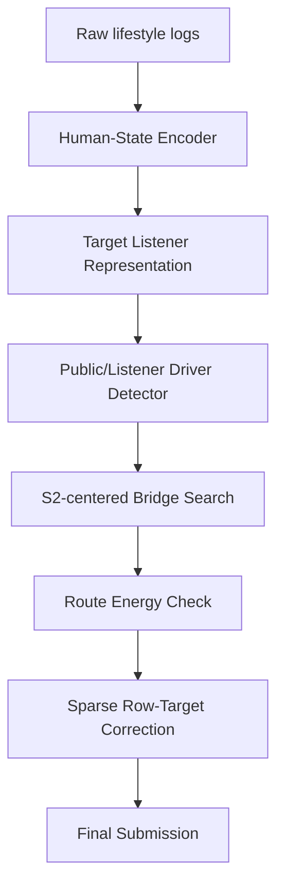

# Route-Conserving S2 Bridge HS-JEPA

## 발표용 핵심 문장

우리는 수면 단계 예측을 7개 label의 독립 분류 문제가 아니라, 숨은 수면 상태 manifold 위에서 움직이는 row-target correction 문제로 본다. HS-JEPA는 public-sensitive correction을 찾되, 그 correction이 Q/S target route를 깨지 않도록 S2-centered bridge action을 함께 예측한다.

## 축구 비유

기존 실험이 “수천 번 슛을 차며 골키퍼 반응을 외운 것”처럼 보일 수 있다면, 이 메커니즘은 다음과 같은 하나의 기술이다.

```text
무회전 슛의 원리:
공을 특정 방식으로 맞히면, 공기 흐름 때문에 예측하기 어려운 궤적이 생긴다.

Route-Conserving S2 Bridge의 원리:
target 하나를 고칠 때, 수면 단계 route manifold를 깨지 않는 bridge target을 함께 움직이면
Log Loss tail을 줄일 수 있는 더 안전한 correction 궤적이 생긴다.
```

핵심은 “많이 차봤더니 이쪽이 좋더라”가 아니라:

```text
correction은 route를 보존해야 한다.
```

라는 물리법칙 같은 제약이다.

## 문제 재정의

표준 관점:

```text
X -> Q1,Q2,Q3,S1,S2,S3,S4
```

HS-JEPA 관점:

```text
X -> hidden human state
X -> target listener state
X -> row-target action field
action field -> route-conserving probability correction
```

## 메커니즘

### 1. Driver

Public sensor와 listener support가 “이 row-target cell은 움직일 가치가 있다”고 말하는 주 action이다.

예:

```text
row i의 S1을 올리거나 내리는 correction
```

### 2. Bridge

Driver만 움직이면 7-target vector가 train label에서 배운 Q/S 공동 구조를 벗어날 수 있다.

그래서 같은 row의 다른 S-stage target을 작은 step으로 같이 움직여 route energy를 낮춘다.

예:

```text
S1 driver + S2 bridge
S4 driver + S2 bridge
S2 driver + S1/S4 bridge
```

### 3. S2 Listener / Hub

반복 실험에서 S2가 bridge 또는 driver로 자주 살아남았다.

중요한 점:

```text
S2가 전체 S-stage factor라는 뜻은 아니다.
S2는 public-sensitive listener/hub에 가깝다.
```

즉 S2는 수면 단계 correction이 public score에 어떻게 들리는지 알려주는 중심 target이다.

### 4. Route Energy

Train label에서 target conditional structure를 배운다.

```text
P(Q1 | others), P(Q2 | others), ..., P(S4 | others)
```

Candidate correction 후 target vector가 이 conditional structure와 충돌하면 energy가 오른다.

좋은 bridge는:

```text
public utility는 유지하면서 route energy를 낮춘다.
```

## 실험 근거

### Objective-Stage Bridge

| 항목 | Stagebridge | Stagebridge Jackpot |
| --- | ---: | ---: |
| selected bundles | `30` | `41` |
| selected cells | `60` | `82` |
| changed rows | `30` | `41` |
| mean route energy | `0.725652` | `0.724352` |
| base route energy | `0.728381` | `0.728381` |
| H088 cosine | `0.006676` | `-0.006888` |

모든 selected action이 driver+bridge 구조로 살아남았다.

### S2-Hub Bridge

| 항목 | S2 Bridge Core | S2 Hub Jackpot |
| --- | ---: | ---: |
| selected bundles | `21` | `34` |
| selected cells | `42` | `68` |
| mean route energy | `0.726721` | `0.724714` |
| H088 cosine | `-0.006979` | `-0.000696` |

S2를 모든 selected bundle에 포함시켜도 route energy가 낮게 유지됐다.

### Human-State Distillation

| 항목 | 값 |
| --- | ---: |
| S2-hub cell OOF AUC | `0.775` |
| S2-hub row OOF AUC | `0.545` |
| Stagebridge cell OOF AUC | `0.722` |
| Stagebridge row OOF AUC | `0.493` |

해석:

```text
Human-state는 action 방향/route를 설명한다.
하지만 row assignment 자체는 단독으로 못 푼다.
```

### Target-Listener Route Lift Negative Result

Target-listener posterior가 찾은 extra S2 action은 route-energy상으로 좋아 보였지만 public LB는 악화됐다.

```text
submission_hsjepa_target_listener_route_lift_s2hub_listener_lift_jackpot_f2ab2816_uploadsafe.csv
public LB: 0.5680255019
best:      0.5677475939
```

이 실패가 중요하다.

```text
Target Listener != Action Generator
Target Listener = Orientation / Diagnostic Representation
```

## 최종 아키텍처



## 왜 참신한가

1. Label 직접 예측이 아니라 correction field를 예측한다.
2. Correction을 독립 target move가 아니라 route-conserving action으로 본다.
3. S2를 단순 target이 아니라 listener/hub로 해석한다.
4. Human-state encoder를 과장하지 않고, action orientation과 assignment를 분리한다.
5. 실패한 target-listener route lift까지 이용해 모듈 경계를 명확히 했다.

## 논문에서 쓸 수 있는 영문 표현

> We propose Route-Conserving S2 Bridge, a competition-aware HS-JEPA decoder that treats multi-label sleep prediction as a sparse row-target correction problem. Instead of moving targets independently, the decoder pairs public-sensitive driver actions with objective-stage bridge actions that preserve a learned target-route manifold. S2 emerges as a public-sensitive listener hub, while human-state representations explain action orientation rather than row assignment.

## 제출 후보

| 역할 | 파일 |
| --- | --- |
| competition primary | `submission_team_hsjepa_route_conserving_objective_bridge_primary_*_uploadsafe.csv` |
| interpretable S2 hub | `submission_team_hsjepa_s2_listener_bridge_interpretable_*_uploadsafe.csv` |
| human-state probe | `submission_team_hsjepa_human_state_gated_s2_bridge_probe_*_uploadsafe.csv` |

## 결론

이 패키지의 주장은 다음 한 문장이다.

```text
수면 단계 예측의 큰 개선은 더 큰 classifier가 아니라,
public-sensitive action을 수면 단계 route manifold 위에서 안전하게 이동시키는
S2-centered bridge decoder에서 나온다.
```
