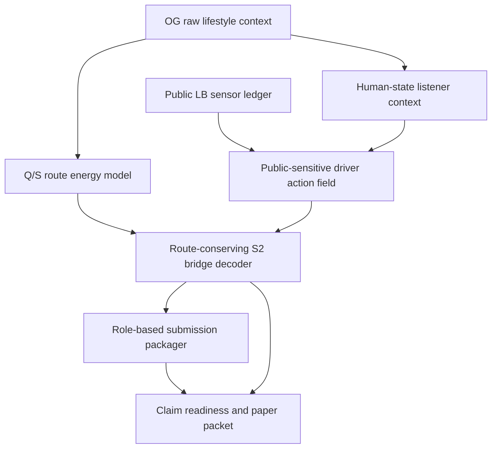

# HS-JEPA Pipeline Manifest

이 문서는 팀원이 OG 데이터에서 최종 제출/논문 산출물까지 어떤 경로로 이어지는지 한눈에 추적하도록 만든 역할 기반 pipeline manifest다.

## One-Command Entry

```bash
python3 team_hsjepa_end_to_end/run_full_team_hsjepa_package.py
```

## Pipeline Diagram



## Stage Table

| Stage | Role | Key Evidence | Boundary |
| --- | --- | --- | --- |
| `og_raw_lifestyle_context` | Provides train labels, submission key contract, and raw lifelog items. | OG records in contract: 3<br>Required missing: 0 | This stage is competition data, not external/private data. |
| `public_lb_sensor` | Uses public submission observations as a sensor for hidden row-target action response. | Ledger rows: 26<br>Pre-public-equation best: 0.5761589494<br>Current best: 0.5677475939 | This is not an OG-only claim; it is the competition-specific sensor path. |
| `human_state_listener_context` | Turns lifestyle/cohort context into target/cell orientation diagnostics. | Cell OOF AUC: 0.775<br>Row OOF AUC: 0.545 | Human-state is an orientation diagnostic, not a standalone row selector. |
| `route_energy_model` | Learns a target-route manifold from train labels and scores whether an action breaks it. | Primary route z-score: -9.66<br>S2 route z-score: -9.46 | Route energy proves candidate-pool structure, not private leaderboard safety. |
| `driver_action_field` | Selects sparse row-target cells that public sensor evidence says are worth moving. | Score breakthrough delta: -0.0084113555<br>Evidence roles: competition_primary, interpretable_s2_hub, human_state_probe | This stage is deliberately separated from the OG human-state representation claim. |
| `route_conserving_s2_bridge_decoder` | Pairs driver cells with same-row bridge cells that lower route energy and repeatedly use S2 as listener/hub. | Primary route delta vs null: -0.02457 vs -0.01090<br>S2 usage vs null: 1.000 vs 0.615 | S2 is a decoder listener/hub in this action space, not a universal sleep physiology claim. |
| `submission_packager` | Packages three role-based outputs without requiring historical version names. | Upload-safe roles: competition_primary, human_state_probe, interpretable_s2_hub<br>Validation passed: True | Upload safety is a format guarantee, not a score guarantee. |
| `claim_readiness_and_paper_packet` | Converts the runnable package into paper/team-facing evidence and method text. | Readiness status: paper_ready_with_boundary<br>Readiness gates: 7/7<br>Method title: Human-State JEPA with Route-Conserving S2 Bridge Decoder | Paper claims must keep representation, public sensor, and action decoder separated. |

## Role-Based Outputs

| Role | Output file |
| --- | --- |
| `competition_primary` | `submission_team_hsjepa_route_conserving_objective_bridge_primary_89d16116_uploadsafe.csv` |
| `human_state_probe` | `submission_team_hsjepa_human_state_gated_s2_bridge_probe_38d995b0_uploadsafe.csv` |
| `interpretable_s2_hub` | `submission_team_hsjepa_s2_listener_bridge_interpretable_f0866f50_uploadsafe.csv` |

## Boundary

- Pure OG-only model: `False`
- Uses public LB sensor: `True`
- Human-state role: `orientation diagnostic, not complete row-target assignment solver`
- Competition decoder role: `public-sensitive row-target action solver with route-conserving S2 bridge`

## Summary

```text
The reusable mechanism is the route-conserving S2 bridge decoder.
The competition-specific sensor supplies sparse driver actions.
The OG human-state representation supplies orientation diagnostics.
The paper claim is valid only when these roles are kept separate.
```
