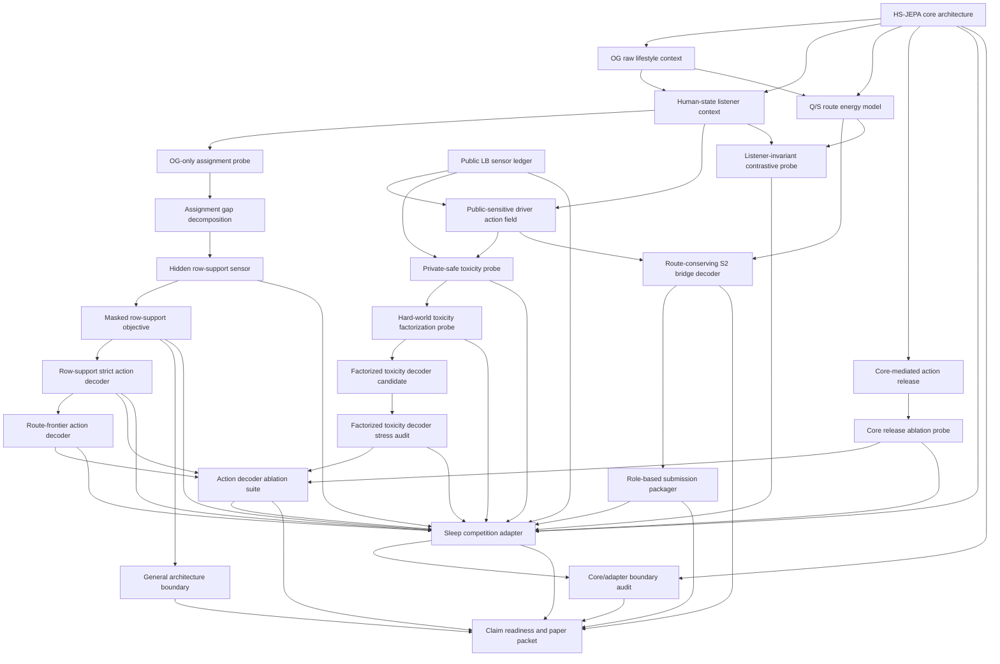

# HS-JEPA Pipeline Manifest

이 문서는 팀원이 OG 데이터에서 최종 제출/논문 산출물까지 어떤 경로로 이어지는지 한눈에 추적하도록 만든 역할 기반 pipeline manifest다.

## One-Command Entry

```bash
python3 team_hsjepa_end_to_end/run_full_team_hsjepa_package.py
```

## Pipeline Diagram



## Stage Table

| Stage | Role | Key Evidence | Boundary |
| --- | --- | --- | --- |
| `hsjepa_core_architecture` | Defines the reusable human-understanding mechanism before any sleep-competition target names are introduced. | Core status: core_ready_for_adapter<br>Core gates: 5/5<br>Ablation status: ablation_contract_ready<br>Reference run: core_reference_ready<br>Module benchmark: core_module_benchmark_ready | The core must not depend on S2, public LB sensors, submission files, or manual row ids. |
| `hsjepa_core_reference_run` | Executes the dataset-free core on synthetic context/listener/action inputs to prove the architecture is not only a report. | Status: core_reference_ready<br>Released actions: ['survey_small_shift']<br>Ablations: ['remove_listener_responsibility', 'remove_action_health', 'remove_invariant_energy'] | This stage is architecture-only; it must not read competition data or sensor observations. |
| `hsjepa_core_module_benchmark` | Tests the reusable core across generic human-state worlds and compares full core against module-removal policies. | Status: core_module_benchmark_ready<br>Scenarios: 5<br>Full-core F1: 1.0000<br>Action-health FP lift: 9<br>Invariant FP lift: 1 | This stage is core-only; it proves architecture behavior without sleep labels or public sensors. |
| `og_raw_lifestyle_context` | Provides train labels, submission key contract, and raw lifelog items. | OG records in contract: 3<br>Required missing: 0 | This stage is competition data, not external/private data. |
| `public_lb_sensor` | Uses public submission observations as a sensor for hidden row-target action response. | Ledger rows: 26<br>Pre-public-equation best: 0.5761589494<br>Current best: 0.5677475939 | This is not an OG-only claim; it is the competition-specific sensor path. |
| `human_state_listener_context` | Turns lifestyle/cohort context into target/cell orientation diagnostics. | Cell OOF AUC: 0.775<br>Row OOF AUC: 0.545 | Human-state is an orientation diagnostic, not a standalone row selector. |
| `og_only_assignment_probe` | Tests whether human-state geometry can replace the public-sensor row-target assignment teacher. | Probe status: og_only_assignment_replacement_not_ready<br>Pure OG row-cap2 recall: 0.0404<br>Distilled row-cap2 recall: 0.1236 | The probe currently measures the gap; it does not prove pure OG-only deployment. |
| `assignment_gap_decomposition` | Decomposes public-sensitive row-target assignment into target-route information and hidden row-support information. | Gap status: row_support_is_primary_bottleneck<br>Best portable recall: 0.1063<br>Row oracle + stage recall: 0.6896<br>Row-support gap: 0.5832 | This is a bottleneck decomposition, not a deployable row-support sensor. |
| `hidden_row_support_sensor` | Learns row-support from one public-sensitive teacher world and tests transfer to another teacher world. | Probe status: portable_row_support_sensor_alive_partial<br>Best portable family: portable_row_support_composite<br>Mean row AUC: 0.8193<br>Mean cell recall with stage prior: 0.3289<br>AUC z vs permuted train: 6.4180 | This is transfer evidence for a row-support sensor, not yet an action-grade deployment decoder. |
| `masked_row_support_objective` | Tests whether hidden row-support can serve as a JEPA target representation predicted from masked human/context views. | Objective status: masked_row_support_objective_supported_with_stress_boundary<br>Full row AUC: 0.8193<br>Full cell recall: 0.3289<br>Human-only cell recall: 0.2713<br>Group stress row AUC: 0.5584 | This supports HS-JEPA representation learning, but weak group-heldout stress blocks direct deployment as an action decoder. |
| `row_support_strict_action_decoder` | Translates masked row-support into route-conserving, toxicity-filtered row-target action candidates. | Decoder status: row_support_action_decoder_alive_with_route_tradeoff<br>Recommended variant: exploratory_route_support_gate<br>Exploratory changed cells: 34<br>Exploratory safety z: 3.64<br>Exploratory combined z: 1.38 | This is an LB-informative big bet with a route-gain tradeoff, not a safe default submission. |
| `route_frontier_action_decoder` | Selects route-manifold frontier actions before trusting row-support and toxicity gates. | Decoder status: route_frontier_action_decoder_alive_with_matched_boundary<br>Recommended variant: seed_route_frontier<br>Variant scores: [{'variant': 'seed_route_frontier', 'changed_cells': 20, 'broad_route_z': 2.631665028357059, 'matched_score_z': 3.6234736097578057, 'upload_safe': True}, {'variant': 's2_route_frontier', 'changed_cells': 20, 'broad_route_z': 2.8237779101897877, 'matched_score_z': 3.3123857088533875, 'upload_safe': True}, {'variant': 'open_route_frontier', 'changed_cells': 20, 'broad_route_z': 2.492261359647143, 'matched_score_z': 3.0831554042259524, 'upload_safe': True}] | This tests whether action-grade decoding should start from route-frontier selection rather than support-first selection. |
| `route_toxicity_fusion_decoder` | Composes route-frontier action ordering with factorized broad-public and hard-world action-health gating. | Decoder status: route_toxicity_fusion_decoder_alive<br>Recommended variant: seed_driver_safe_route_fusion<br>Variant scores: [{'variant': 's2_route_toxicity_fusion', 'changed_cells': 8, 'broad_route_z': -0.06361725497399186, 'toxicity_matched_safety_z': 0.0, 'toxicity_matched_fusion_z': 0.00022199529973856787, 'upload_safe': True}, {'variant': 'seed_route_toxicity_fusion', 'changed_cells': 8, 'broad_route_z': -0.05413537720642773, 'toxicity_matched_safety_z': 0.0, 'toxicity_matched_fusion_z': 0.00022199529973856787, 'upload_safe': True}, {'variant': 'open_route_toxicity_fusion', 'changed_cells': 4, 'broad_route_z': -0.16743111973717828, 'toxicity_matched_safety_z': 0.00022199529973856787, 'toxicity_matched_fusion_z': 0.0, 'upload_safe': True}, {'variant': 's2_driver_safe_route_fusion', 'changed_cells': 20, 'broad_route_z': 2.5212391425980725, 'toxicity_matched_safety_z': 1.4350151378530516, 'toxicity_matched_fusion_z': 3.333896510179827, 'upload_safe': True}, {'variant': 'seed_driver_safe_route_fusion', 'changed_cells': 20, 'broad_route_z': 1.956452255410393, 'toxicity_matched_safety_z': 1.1375544203021746, 'toxicity_matched_fusion_z': 4.040831045742473, 'upload_safe': True}, {'variant': 'open_driver_safe_route_fusion', 'changed_cells': 20, 'broad_route_z': 1.2492144363720237, 'toxicity_matched_safety_z': 1.1862432357203119, 'toxicity_matched_fusion_z': 1.8706591048812475, 'upload_safe': True}] | This is a competition-adapter action solver; it does not prove private-LB safety or pure OG-only assignment. |
| `decoder_order_jury_solver` | Releases only row-target actions independently selected by route-frontier and route-toxicity fusion decoders. | Solver status: decoder_order_jury_ready<br>Recommended LB sensor: {'variant': 'family_supermajority', 'submission_file': 'submission_hsjepa_decoder_jury_family_supermajority_a7bc4ff7_uploadsafe.csv', 'priority': 1.392520579892158} | This tests whether HS-JEPA action decoding should be a cross-decoder listener jury rather than a single route or toxicity score. |
| `decoder_boundary_tomography_solver` | Splits cells rejected by strict cross-decoder jury into weak-consensus, route-only, and fusion-only action worlds. | Tomography status: boundary_tomography_ready<br>Recommended LB sensor: {'variant': 'consensus_shadow_plus', 'submission_file': 'submission_hsjepa_boundary_tomography_consensus_shadow_plus_04b2c855_uploadsafe.csv', 'priority': 0.6990859175252038}<br>Boundary inventory: {'strict_jury_cells': 19, 'consensus_shadow_cells': 13, 'route_only_cells': 6, 'fusion_only_cells': 6, 'conflict_cells': 0} | This is the too-conservative-jury diagnostic; consensus-shadow cells are not safe until public LB observes them. |
| `core_mediated_action_release` | Converts real sleep-adapter row-target actions into the generic HS-JEPA core API before release. | Core-mediated status: core_mediated_action_release_ready<br>Recommended LB sensor: {'variant': 'core_consensus_shadow_plus', 'submission_file': 'submission_hsjepa_core_mediated_core_consensus_shadow_plus_3b0b1d0f_uploadsafe.csv', 'priority': 0.8460231888716516}<br>Cell inventory: {'candidate_cells': 44, 'strict_cells': 19, 'consensus_shadow_cells': 13, 'route_only_cells': 6, 'fusion_only_cells': 6, 'default_core_released': 32} | This proves the core API can drive adapter actions mechanically; public LB still decides whether that core release equation is action-grade. |
| `core_release_ablation_probe` | Removes listener responsibility, action-health, or invariant energy from the real adapter release equation to make HS-JEPA core constraints falsifiable. | Ablation status: core_release_ablation_ready<br>Full-core LB candidate: {'variant': 'full_core_reference', 'submission_file': 'submission_hsjepa_core_ablation_full_core_reference_513175a1_uploadsafe.csv', 'priority': 0.8314097090596275}<br>Architecture sensor: {'variant': 'no_action_health', 'submission_file': 'submission_hsjepa_core_ablation_no_action_health_043b20c7_uploadsafe.csv', 'priority': 0.3281725643379389} | This is an architecture falsification probe; module-removal public LB is needed before claiming a removed module improves the adapter. |
| `action_decoder_ablation_suite` | Ranks toxicity-first, support-first, route-first, route-toxicity fusion, decoder-jury, boundary-tomography, core-mediated, and core-release-ablation alternatives as HS-JEPA module ablations. | Suite status: action_decoder_ablation_ready_decoder_jury_leads<br>Recommended LB sensor: {'family': 'decoder_order_jury', 'variant': 'family_supermajority', 'submission_file': 'submission_hsjepa_decoder_jury_family_supermajority_a7bc4ff7_uploadsafe.csv', 'priority': 1.394366527938867}<br>Open big-bet sensor: {'family': 'route_frontier', 'variant': 'open_route_frontier', 'submission_file': 'submission_hsjepa_open_route_frontier_a1719e99_uploadsafe.csv', 'priority': 1.05448050759572} | This prioritizes public-sensor experiments; it is not a calibrated LB predictor. |
| `route_energy_model` | Learns a target-route manifold from train labels and scores whether an action breaks it. | Primary route z-score: -9.66<br>S2 route z-score: -9.46 | Route energy proves candidate-pool structure, not private leaderboard safety. |
| `listener_invariant_contrastive_probe` | Tests whether listener responsibility and route-invariant action health select the same bundles. | Probe status: listener_invariant_decoder_not_ready<br>Listener-route rho: -0.0313<br>Contrastive overlap: 0.2152 | This stage is a diagnostic; it does not create a new submission. |
| `private_safe_toxicity_probe` | Tests whether toxicity head generalizes across bad public anchors and selects safer cells than matched nulls. | Probe status: toxicity_field_promising_with_hardworld_gap<br>Mean LOO bad-anchor AUC: 0.7880<br>Worst LOO bad-anchor AUC: 0.3683<br>Safety z vs matched null: 8.4589 | This stage supports toxicity diagnostics, not a private-LB safety guarantee. |
| `hardworld_toxicity_factorization_probe` | Tests whether the H088 hard-world toxicity mode is anti-correlated with broad public-bad toxicity. | Probe status: hardworld_mixture_factorization_required<br>Broad->H088 AUC: 0.3683<br>Broad/H088 rho: -0.4276<br>Joint safety z: 7.1884 | This diagnostic stage says action-health should be factorized; the following decoder stage is the submission translation. |
| `factorized_toxicity_decoder_candidate` | Translates broad-public and hard-world toxicity heads into upload-safe row-target action candidates. | Decoder variants: dual_safe_expansion, teacher_dual_head<br>Upload-safe variants: 2/2 | This creates competition submissions, but their public/private score impact remains unverified until external submission. |
| `factorized_toxicity_decoder_stress_audit` | Compares factorized decoder variants against target-only and source-matched feasible null action fields. | Stress status: stress_audit_ready<br>Supported variants: dual_safe_expansion<br>Iterations: 1500 | This is local action-health evidence; external public/private LB remains a separate sensor. |
| `driver_action_field` | Selects sparse row-target cells that public sensor evidence says are worth moving. | Score breakthrough delta: -0.0084113555<br>Evidence roles: competition_primary, interpretable_s2_hub, human_state_probe | This stage is deliberately separated from the OG human-state representation claim. |
| `route_conserving_s2_bridge_decoder` | Pairs driver cells with same-row bridge cells that lower route energy and repeatedly use S2 as listener/hub. | Primary route delta vs null: -0.02457 vs -0.01090<br>S2 usage vs null: 1.000 vs 0.615 | S2 is a decoder listener/hub in this action space, not a universal sleep physiology claim. |
| `submission_packager` | Packages three role-based outputs without requiring historical version names. | Upload-safe roles: competition_primary, human_state_probe, interpretable_s2_hub<br>Validation passed: True | Upload safety is a format guarantee, not a score guarantee. |
| `mechanism_ablation_knockout` | Records which alternative worldviews public sensors and local stress audits killed or preserved. | Public worldviews killed: 5<br>Public worldviews survived: 2<br>Ablation status: mechanism_ablation_ready | This explains mechanism evidence; it is not a new private-score guarantee. |
| `general_architecture_boundary` | Separates reusable HS-JEPA modules from the sleep-competition S2/public-sensor instantiation. | Generality status: general_architecture_separated_with_case_boundary<br>Portability checks: 8/9<br>Nonblocking boundaries: remaining_generality_gap | The current strongest case study still uses a public-sensor assignment teacher. |
| `sleep_competition_adapter` | Maps HS-JEPA Core into Q/S listeners, route energy, public-sensor action evidence, and upload-safe sparse row-target outputs. | Adapter status: adapter_ready_with_public_sensor_boundary<br>Adapter score delta: -0.0084113555<br>Big-bet count: 13 | This adapter is a competition case study; it is not the general HS-JEPA architecture. |
| `core_adapter_boundary_audit` | Statically verifies that HS-JEPA Core has no operational dependency on competition adapters and that the adapter depends on the core contract. | Boundary audit status: core_adapter_boundary_verified<br>Boundary audit checks: 6/6<br>Core import violations: 0 | This verifies architecture separation; it does not create a new prediction or score guarantee. |
| `claim_readiness_and_paper_packet` | Converts the runnable package into paper/team-facing evidence and method text. | Readiness status: paper_ready_with_boundary<br>Readiness gates: 7/7<br>Method title: Human-State JEPA: General Architecture with a Route-Conserving S2 Bridge Case Study | Paper claims must keep representation, public sensor, and action decoder separated. |

## Role-Based Outputs

| Role | Output file |
| --- | --- |
| `competition_primary` | `submission_team_hsjepa_route_conserving_objective_bridge_primary_89d16116_uploadsafe.csv` |
| `human_state_probe` | `submission_team_hsjepa_human_state_gated_s2_bridge_probe_38d995b0_uploadsafe.csv` |
| `interpretable_s2_hub` | `submission_team_hsjepa_s2_listener_bridge_interpretable_f0866f50_uploadsafe.csv` |

## Boundary

- Pure OG-only model: `False`
- Uses public LB sensor: `True`
- Human-state role: `orientation diagnostic, not complete row-target assignment solver`
- Competition decoder role: `public-sensitive row-target action solver with route-conserving S2 bridge`

## Summary

```text
The reusable mechanism is HS-JEPA Core: hidden state -> listener -> action-health -> invariant decoder.
The sleep competition adapter supplies Q/S listeners, public-sensor actions, route energy, and upload format.
The boundary audit verifies that this is a real dependency split, not only a naming convention.
The current LB breakthrough is adapter evidence; the paper claim must remain core-first.
The next jackpot is either a better public/private action-health factorization or evidence that one HS-JEPA core constraint over-constrains real row-target release.
```
